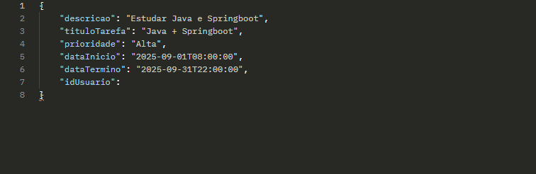
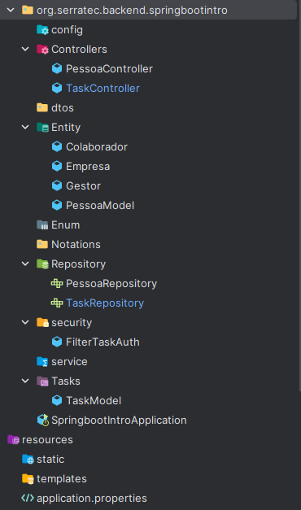

***Em elaboração do readme com o andar do projeto e a construção da API***

# Mini - Curso Introdutório em desenvolvimento de API

Um pequeno projeto introdutório, ensinando a elaborar a criação, consumação e projetos 
de API, utilizando rotas com os verbos HTTP e autenticação de usuário com senha.

O módulo visa desenvolver uma pequena lista de tarefas (TO-DO List), utilizando JAVA e Springboot,
criando rotas HTTP, validar parametros, realizar a integração com banco de dados e implementar as autenticações
seguras utilizando o JWT com Spring Security.

No final da criação e elaboração da api, será feito o deploy para compartilhamento do projeto.
 

## Stack utilizada

**Back-end:** H2 Data-Base, Java 17, PostMan, SpringBoot e Maven.

